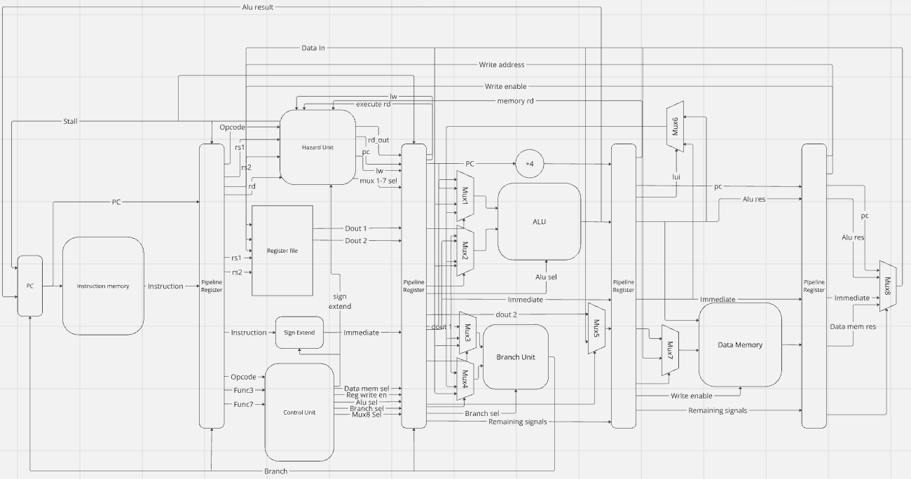

# Full instruction set 32-IM architecture

### Schematic
In the schematic below, the mux select wires are unlabelled and several wires have been grouped togethor such as 'Mux 1-7 sel'. This has been done for the sake of clarity.

### Mux sel table

