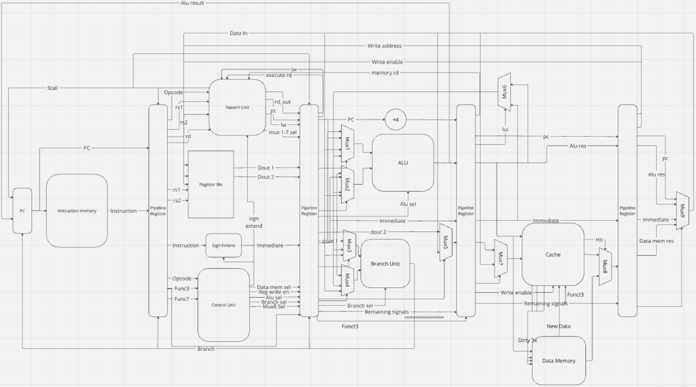
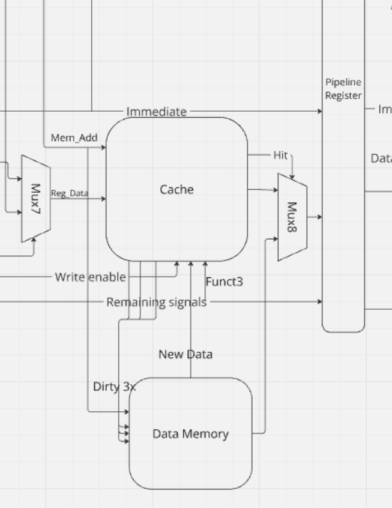

# RISC-V-Group-20 Cache

**This branch implements cache into a fusion architecture of pipelined cpu 2 and main, and executes the entire instruction set.**

## Schematic
The wider schematic to give context to the cache implementation.

Zoomed in schematic.

## Details
We implemented a 2-Way Set Associative Cache with a storage capacity of 4096 data bytes.
We went with 2-Way to improve our rates with conflict misses, as in a 2-way cache, two blocks in the same set can be stored in cache - unlike in direct mapped cache where using multiple blocks of the set would cause lots of misses. This is a problem, as it means data has to be fetched from the main memory, which is much slower and less energy efficient. Thus the detriment to CPU efficiency can be drastic. 

The cache utilises least recently used (LRU) for its retention policy, as this seems like the most sensible option for maximising temporal locality. It also seemed like a great design choice for 2-way specifically, as you could hard-code an LRU bit into each block of the way that would go high for whichever one was accessed and low for the one not accessed (referred to as twin in the verilogs).

For cache coherency, we've decided to use a write-back policy, implementing dirty bits to ensure data isn't lost when evicting blocks.
Subsequently, the DRAM's capability to STORE was disabled, as the cache would now handle those and write-back afterwards. It also had to be given new inputs to handle the dirty data as it was being evicted: the data, it's corresponding address, and an enable. The enable was the dirty bit, which when high, would tell the DRAM to write the dirty data being fed to it at the dirty address it was being told.

A mux was implemented that would choose between passing on the data output from cache or main memory. The select signal that would choose was the hit detection bit from cache. This would go high and select the data from cache if there was a match between the tags and memory input (and valid bits are high), otherwise it would remain low and allow the output from DRAM to pass on. This implementation means that even for STORE, data is passed out from one of the two (cache or DRAM), but this will be discarded by the next mux after pipeline reg 4.

## Proof of function
### [Link to demos](https://www.youtube.com/watch?v=y0XfobdrZcU&list=PLdeaaZuxLlWtO-BnAFKly6QJmn4A7G8WB)

