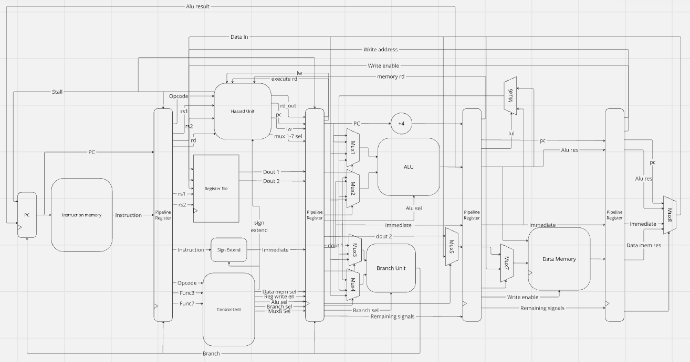
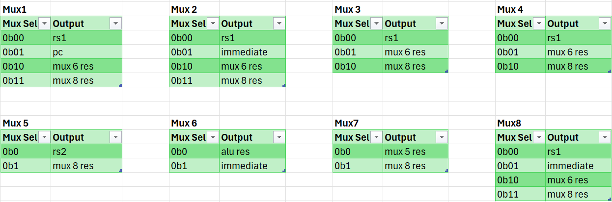

# Full instruction set 32-IM architecture
This branch contains a pipelined 32-IM RISC-V architectre with the entire instruction set.  
For a more detailed commit history of this version please see: [Pipelined Risc-V](https://github.com/TheZuzuSnuSnu/Risc-V), access has been given to pykc.

## Schematic
In the schematic below, the mux select wires are unlabelled and several wires have been grouped togethor such as 'Mux 1-7 sel'. This has been done for the sake of clarity.

## Mux sel table
The table below cotains the select codes for the varying muxes to help make the schematic above clearer. The alu select and branch select remain the same as in single cycle.

## Evidence of working cpu
