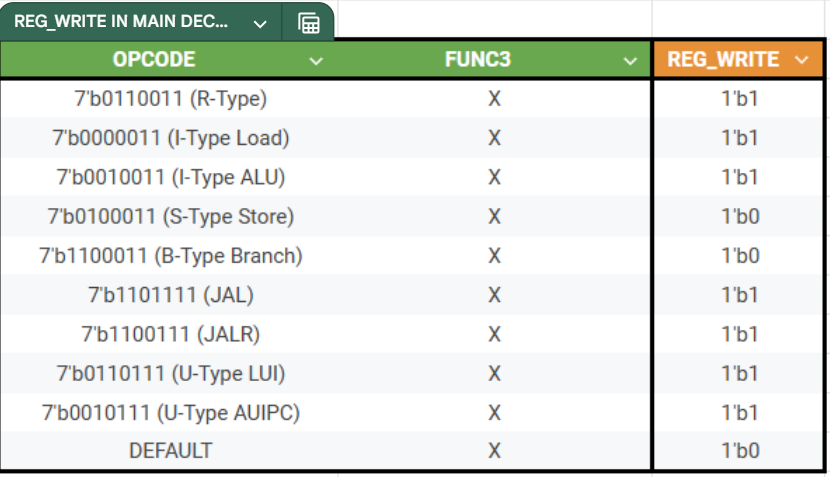

## RISC-V-Group-20 Documentation (IAC Coursework)

 

### **Objectives**

- [x] To learn RISC-V 32-bit integer instruction set architecture 
- [x] To implement a single-cycle **RV32IM** instruction set in a microarchitecture
- [x] To implement the F1 starting light algorithm in **RV32IM** assembly language
- [x] To verify your **RV32IM** design
- [x] As stretched goal, to implement a simple pipelined version of the microarchitecture with hazard detection and mitigation
- [ ] As a further stretched goal, add data cache to the pipelined **RV32IM**
- [x] As a further streched goal, complete the **RV32IM** processor

Our individual statements are included here:
[Aadin](statements/Aadin-Personal-Statement.md)
[Ethan](statements/Ethan-Personal-Statement.md)
[Darryl](statements/Darryl-Personal-Statement.pdf) - Darryl-Personal-Statement.pdf in statements
[Dawud](statements/Dawud-Individual-Statement.md)
[Aidan](statements/)

 

---

 

### **Conventions**

- **Snakecase** (snake_case)
- Ensure all variables have a **lowercase** letter (so that the extensions colour them correctly)
- Keep variable names as **simple** and **clear** as possible (where possible, stick to the diagrams)
- Module declaration convention (see [mux.sv](rtl/mux.sv) for reference):
    - **One** tab after _input/output_ 
    - **One** soace bar after _logic_ 
    - **[XXXX_WIDTH-1:0]** 
    - **One** tab after longest bracket and then variable name

 

---

 

### **Single Cycle Breakdown**

- [reg_file.sv](rtl/reg_file.sv)
- [control_unit.sv](rtl/control_unit.sv)
    - [main_decoder.sv](rtl/main_decoder.sv)
    - [alu_decoder.sv](rtl/alu_decoder.sv)
- [instruction_memory.sv](rtl/instruction_memory.sv)
- [mux.sv](rtl/mux.sv)
- [mux4.sv](rtl/mux4.sv)
- [program_counter.sv](rtl/program_counter.sv)
- [sign_extend.sv](rtl/sign_extend.sv)
- [data_memory.sv](rtl/data_memory.sv)
- [_top.sv_](rtl/top.sv) 

 

---

 

## Contributions

| Username | Person |
|:-------:|:-------:|
|**MAadinP**|Aadin|
|**root** (TheZuzuSnuSnu)|Ethan|
|**DarrylProgrammer**|Darryl|
|**dk7-stacker**|Dawud|
|**ak6123**|Aidan|

### Submodule Task Allocation

**Key**
**✘** - Main Contribution
✗ - Assisted/Fixed

| Tasks  |  Aadin  |  Ethan  |  Darryl  |  Dawud  |  Aidan  |
|:------:|:-------:|:-------:|:--------:|:-------:|:-------:|
| repo set up | **✘** |  |  |  |  |
| **Single Cycle** |  |  |  |  |  |
| alu_decoder | ✗ |  | **✘** |  |  |
| alu |  |  | **✘** |  |  |
| branch_control | **✘** |  |  |  |  |
| control_unit | ✗ |  |  | ✗ |  |
| data_memory | **✘** | ✗ |  |  |  |
| datapath_top | **✘** |  |  |  |  |
| instruction_memory |  | **✘** |  |  |  |
| main_decoder | ✗ |  |  | ✗ |  |
| program_counter |  | ✗ |  |  | **✘** |
| reg_file |  | **✘** |  |  |  |
| sign_extend | **✘** |  |  |  |  |
| top | **✘** |  |  |  |  |
| --- |  |  |  |  |  |
| **Pipelined-cpu** |  |  |  |  |  |
| hazard_unit |  |  | **✘** |  |  |
| branch_unit |  |  |  | **✘** |  |
| control_unit |  |  | ✗ |  |  |
| pipeline_reg |  |  | **✘** |  |  |
| alu_decoder |  |  | ✗ |  |  |
| top (+ top levels for stages) |  |  | **✘** |  |  |
| **Pipelined-cpu-2** |  |  |  |  |  |
| hazard_unit | | **✘** |  |  |  |
| control_unit | | **✘** |  |  |  |
| pipeline_registers | | **✘**  |  |  |  |
| data_memory | | **✘**  |  |  |  |
| design | ✗ | **✘** |  |  |  |
| **Cached-cpu** |  |  |  |  |  |
| cache.sv |  |  |  |  | **✘** |
| data memory |  |  |  |  | **✘** |
| hit mux |  |  |  |  | **✘**  |
| top | ✗  |  |  |  | **✘** |

#### Single Cycle Schematic

 

---

 

### Testbenches

- CPU Tests
- Main Decoder
- Mux
- Register File 
- PDF Vbuddy
- F1 Vbuddy
- Extra Instructions 
- Unused Unit Tests

| Tasks  |  Aadin  |  Ethan  |  Darryl  |  Dawud  |  Aidan  |
|:------:|:-------:|:-------:|:--------:|:-------:|:-------:|
| all_tests.sh | **✘** |  |  |  |  |
| reference.sh | **✘** |  |  |  |  |
| reference_tb.cpp| **✘** |  |  |  |  |
| f1.sh | **✘** |  |  |  |  |
| f1_vbuddy.cpp | **✘** |  |  |  |  |
| auipc.s | |  |  | **✘** |  |
| auipc_tb.cpp| |  |  | **✘** |  |
| lbu_lhu.s | |  |  | **✘** |  |
| lbu_lhu_tb.cpp| |  |  | **✘** |  |
| (unused) instruction_memory_tb.cpp | |  |  | **✘** |  |
| (unused) regfile_tb.cpp | | **✘** |  |  |  |
| (unused) main_decoder.cpp | |  |  | **✘** |  |
| (unused)  | |  |  | **✘** |  |

### How to Run Tests

- Run all tests by calling [./all_tests.sh](all_tests.sh)
- This will run tests in the following order:
    1. All CPU tests - [verify](tb/tests/verify.cpp) 
    2. All other tests written to confirm that all extension instructions work - [tb](tb/tests/)
    3. Check to see if Vbuddy is connected and then run the F1 Vbuddly Lights (**toggle trigger on** with vbuddy button  to start the lights sequence)
    4. Checks to see if vbuddy is connected and then plot the following in infinite loops
        1. PDF plot for noisy.mem
        1. PDF plot for gaussiam.mem
        1. PDF plot for triangle.mem
        1. PDF plot for sine.mem
    5. **Press q to quit during the pdf plot process to move onto the next pdf**

    
 

---

 

### Demo Youtube Links

[playlist link](https://www.youtube.com/watch?v=qjUhrumEX5c&list=PL78xv8np-SRZvxV5_pwV2YfbVGvgrlxk_&index=1)

[F1_demo](https://youtu.be/oubu2vcvN4A)
[gaussian_demo](https://www.youtube.com/watch?v=XsvtbyOxPrA&list=PL78xv8np-SRZvxV5_pwV2YfbVGvgrlxk_&index=5)
[noisy_demo](https://www.youtube.com/watch?v=qjUhrumEX5c&list=PL78xv8np-SRZvxV5_pwV2YfbVGvgrlxk_&index=1)
[triangle_demo](https://www.youtube.com/watch?v=rP_yzRazzSI&list=PL78xv8np-SRZvxV5_pwV2YfbVGvgrlxk_&index=4)
[sine_demo](https://www.youtube.com/watch?v=FSrQJ3Ej-L4&list=PL78xv8np-SRZvxV5_pwV2YfbVGvgrlxk_&index=3)

 

---

 

### Extension - Pipelined CPU + RISCV-32M Implementation

#### Main Branch - Single Cycle CPU
- Base single cycle CPU implementing 32IM instrucitons (excluding ecall/ebreak)

#### Pipelined CPU
- A base pipelined cpu with a different architecture - Incomplete
[read more here](https://github.com/MAadinP/RISC-V-Group-20/tree/pipelined-cpu)

#### Pipelined CPU-2
- Implements the full instruction set
[read more here](https://github.com/MAadinP/RISC-V-Group-20/tree/pipelined-cpu-2)

#### Cached CPU
- Implements 2 way associative cache
[read more here](https://github.com/MAadinP/RISC-V-Group-20/tree/cached-cpu)

 

---

 

### References

#### Control Unit

##### ALU Decoder (Control Unit)

##### Main Decoder (Control Unit)

 <table> 

<tr> <td>  </td> <td>  <td> </tr> 
<tr> <td></td> <td></td> </tr> 
<tr> <td></td> <td></td> </tr> 
<tr> <td></td> <td></td> </tr> 

</table> 

#### Branch Unit
    

#### Sign Extend

#### ALU

#### Data Memory  

- Extension Implementation of **LB/LH/LBU/LHU, SB/SH**

