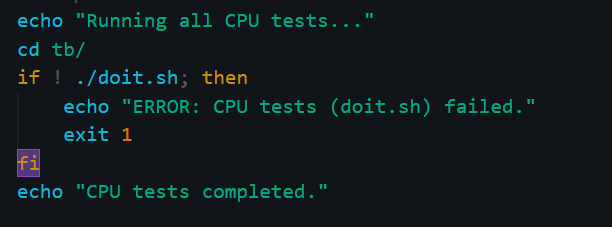
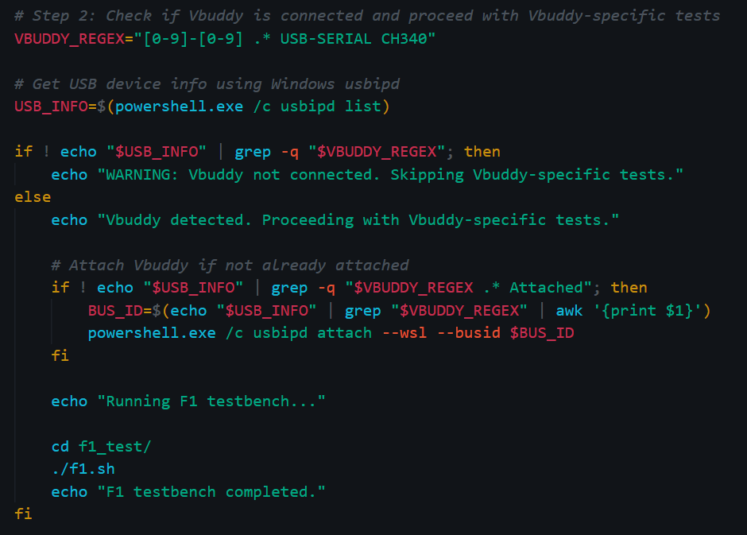
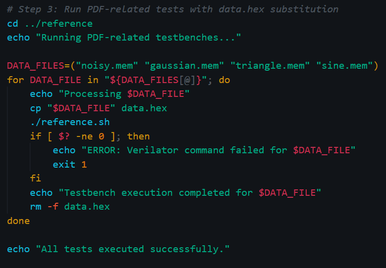
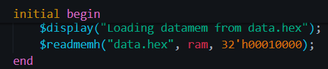
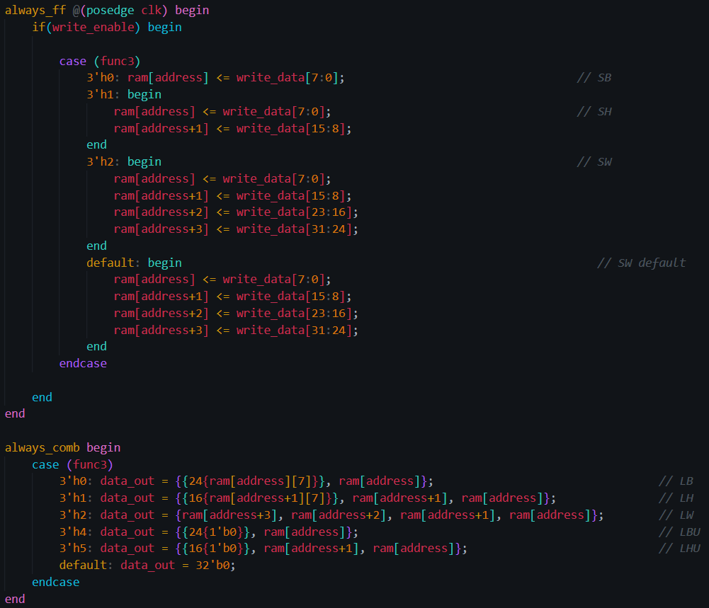
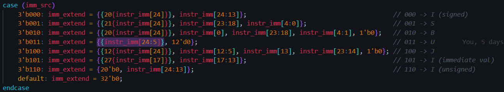
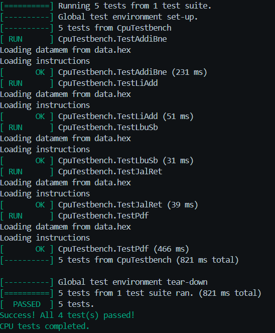

## Aadin Personal Statement

explaining what you contributed, 
a reflection about what you have learned in this project, 
mistakes you made, 
special design decisons, and what you might do differently if you were to do it again 

### Contents

[**Reflections**](#reflections)

[**Design Decisions**](#design-decisions)
- [all_tests.sh](#all_testssh)
- [data_memory.sv](#data_memorysv)
- [branch_control.sv](#branch_controlsv)
- [sign_extend.sv](#sign_extendsv)
- [alu_decoder.sv](#alu_decodersv)
- [top.sv](#topsv)
- [complete testing](#complete-testing)
- [cache](#cache)

[**What would I do differently?**](#what-i-might-do-differently)

 

---

 

### Reflections

- From this coursework, I learned how to overcome challenges when working as a group, especially to do with different skill levels and commitments of teammates
- I learnt to a deeper extent how to use Github and git version control in a way that might emulate a professional workspace
- I learnt how to write bash scripts to a much higher level for example evidenced in [all_tests.sh](../all_tests.sh) to solve the problem of running many tests with different strutures and requirements
- What I did well was as well as being repo master, I also had to micromanage every individuals work, which I often found demanding but I dealt with it in a structured way - for instance, to help my teammates, I made control logic table so that everyone had a centralised form to compare control/logic signals to
- One key realisation was to always deleting obj_dir folders before testing as it might indicate a test passing falsely as the new obj_dir/ wouldn't make and the older executable would run
- 

### Design Decisions

- The design for the single cycle cpu was mainly driven by me. I opened a drawing board on the web app called Miro to change the cpu layout from lab 4 to incorporate the full 32IM instruction set. I invited all my teammates to collaborate in this space
- This meant redesigning some important control signals and alu operations. Also meant the ALU would change and extra internal wires would have to be added to allow for 64 bit logic to exist but the relevant 32 bits to be selected.
- All these signals and control logic was tabulated and documented - see [references](../README.md)
- This also changed the data memory as I now needed to implement half words and bytes and unsigned versions of these.
- I also evidenced these tests by uploading videos of the working reference tests onto youtube in a playlist

#### all_tests.sh

- **Relevant Commit Names:** 
    - _fully functional all_tests.sh script and added to single cycle documentations_
- Written to call all tests and testbenches available in the tb/ folder in one command.
- This script starts by running the Gtest testbenches and the output for the number of tests passed can be seen in the terminal
- 

- This bit of the script makes sure that all the tests pass in which case it will proceed to the next tests will be run

- In an incorrect case:
    - enter the tb directory and run **./doit.sh** <tests/<file_tb.cpp>> to run an individual test or without any parameters to run all tests in the tests/ directory 
    - enter the reference directory and running the **./reference.sh** (ensure that the data memory is initialised to the relevant .mem file)
- The next stage is to connect the vbuddy and then execute the f1 program and the pdf plots

- This was really exciting as it solved a problem of running tests from different places with different commands - this script centralised all relevant testing. This is the script I am most proud of as I learnt a lot about the Vbuddy as well, which is an interesting piece of hardware to explore

### major fixes

- **Relevant Commit Names:**
    - _all control signals updated_

- There were some major fixes from the initial main decoder made by Dawud. There were plenty of control signals missing/not yet implemented
- These included all select  signals for the muxes before the ALU. I also redesigned the alu decoder to include a 5 bit signal to implement all multiply instructions. The control signal from the alu decoder was increased to 5 bits to achieve this.
- The instruction memory was changed to always load a file named program.hex from the directory that the verilator command was called from. This led to some issues with making paths match, which I eventually solved in the scripts I wrote - such as in reference.sh and f1.sh
-  The scripts called also had associated test benches

#### data_memory.sv

- **Relevant Commit Names:**
    - _top level in progress_

- In this file, I wrote all the logic to implement LB, LBU, LH, LHU and LW along side SW, SH and SB
- I used func3 as an extra logic input to distinguish between instructions withing data mem using case statements
- The data is loaded at an offset as well to meet the specification

- I wrote the control logic into a table on excel in a centralised place for any teamamates to see and use as a reference for any units they write 

#### branch_control.sv

- **Relevant Commit Names:**
    - _top level in progress_

- Takes the data from the output of the register file and then using a branch_src control signal to do the relavant conditional comparison, then outputs pc_src to take the conditional change in PC
- Put this block outside the control unit as I could see issues with the decode stage in the pipelined cpu, made for scalability into pipelining.
- Realised that the branch unit would sit in a different stage to the control unit in a pipelined implementation of the cpu.
- The main challenge here was

#### sign_extend.sv

- **Relevant Commit Names:**
    - _top level in progress_

- Designed to work for all types of instructions especially multiply and U type instructions. The design of the datapath means no extra additoinal adders are needed and all the additions and calculations on the PC value are done in the ALU and the relevant control signals guide the correct output to the correct destination (whether that be PC for jumps, branches, auipc instructions, register file or the data memory)
- These were initially incorrect as i had teh wrong bit widths and incorrectly added two zeros to the bottom of 
 

#### alu_decoder.sv

- **Relevant Commit Names:**
    - _top level in progress_

- Started by writing alu decoder, which Darryl then took control of and then returned. That decoder had some minor issues as they 
- After that the alu control had to be changed to fix the bug because the I type instructions were using func7 as logic to find whether to implement a multiply or a regular operation. This was unreliable

#### top.sv 

- **Relevant Commit Names:**
    - _top level in progress_
    - _removed old test file, fixed branch unit, progress on the top file_

- Put the entire cpu together drawing the followin cpu schematic as a reference
- Then I wrote and organised all the tests into relevant independant test folders where there would be no overlap
- Connected wires and individual logics. All those intermediary wires were suffixed with _wire to be clear
- Learnt that logic can be high, low undriven and undefined while wire cannot hold values

#### complete testing

- **Relevant Commit Names:**
    - _finished pdf testbench and f1 for vbuddy_
    - _f1 program written_
    - _f1 asm written_ 

- Inital design of the assembly code was rather long and utilised data memory but it did not use a0 to return the values for vbuddy to light up the led lights.
- Once this was fixed, I realsied that there was always a fixed delay between each light, even when flicking from all on to all off
- This meant I had to implement a random number generator from a simple seed number. This delay would be different from the normal pace as below:

#### cache

- **Relevant Commit Names:**
    - _debugging reset_
    - _fixing_
    - _fixing in progress_

- Helped to put together the top level of the cache
- Fixed errors and warnings that prevented all_tests.sh from running
- Managed to fix design and implemention errors to go from 40 errors to 4/5 tests passed
- Filmed

### What I might do differently?

- Within the group, I would enforce a better and stricter timeline so that I can manage when people deliver their sections and leave enough time for them to test and for me to help them with their tests. 
- I feel like communication was weak towards the start even though I tried to orgainse meetings regularly. I think towards the end, the team put in a good shift and thats when things started to pick up a bit, but I felt pressured to fix any errors they made, especially because most of the time, I couldn't ask them to fix it themselves in case it too long and we would fall behind.
- If I had more time, I would continue to add instruction cache and even more layers of cache. I would love to have experimented with 
