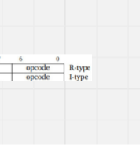
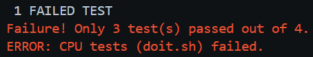

## Aadin Personal Statement

explaining what you contributed, 
a reflection about what you have learned in this project, 
mistakes you made, 
special design decisons, and what you might do differently if you were to do it again 

### Contents

- [all_tests.sh](#all_testssh)
- [data_memory.sv](#data_memorysv)
- [branch_control.sv](#branch_controlsv)
- [sign_extend.sv](#sign_extendsv)
- [alu_decoder.sv](#alu_decodersv)
- [top.sv](#topsv)
- [f1-test](#f1-test)
- [cache](#cache)

 

---

 

### all_tests.sh

- Relevant Commits:
- Written to call all tests and testbenches available in the tb/ folder in one command.
- This script starts by running the Gtest testbenches and the output for the number of tests passed can be seen in the terminal
- 
- This bit of the script makes sure that all the tests pass in which case it will proceed to the next tests will be run

- In an incorrect case:
    - enter the tb directory and run ./doit.sh <tests/<file_tb.cpp>> to run an individual test or without any parameters to run all tests in the tests/ directory 
    - enter the reference directory and 

### data_memory.sv

### branch_control.sv

### sign_extend.sv

### alu_decoder.sv

### top.sv 

### f1-test

### cache
