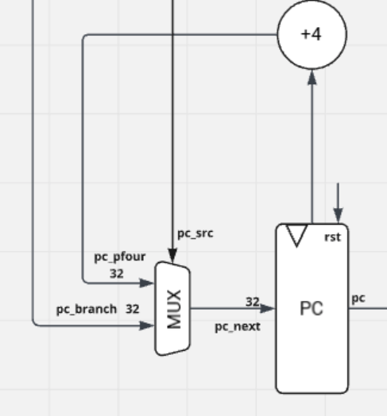
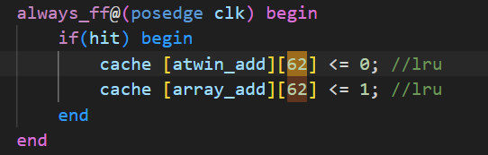
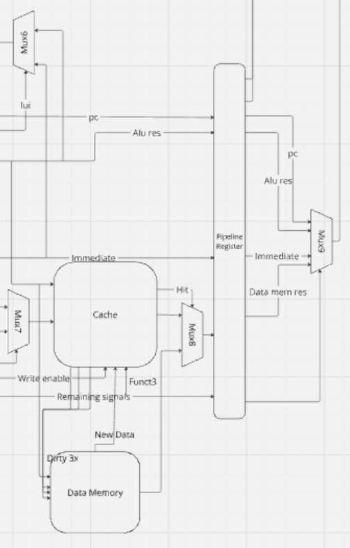

# Aidan Khan - Personal Statement

## Contributions:

- Main - Program Counter 
- Cached - Cache 
- Cached - Data Memory 
- Cached - Mux
- Cached - Top

### Program Counter:

The program counter (PC) is the most fundamental component of a CPU, as it ensures the proper sequencing and execution of instructions.  Hence it is the main clocked component in the single cycle CPU (CPUs where all operations are completed in one clock cycle.), as it drives the entire fetch-decode-execute cycle. The PC is specifically responsible for the fetching element of the cycle, and the sequencing of instructions, as it points to where the current instruction resides and updates to point to the next instruction.

Typically the count increments by 4 as the instructions are byte addressable, so in the absence of branches/jumps, this default will sequentially go through the instructions. This functionality is implemented through a mux, with a select value that only goes high in the presence of branches/jumps - an output fed into the PC by the branch control.

In the case of a branch/jump, the ALU will feed the next instruction address into the PC through the mux, which has now appropriately changed its output thanks to the select signal coming out of the branch control.

  

### Cache:
The cache is a small, high-speed memory unit located closer to the processor compared to the DRAM. Its purpose is to store frequently accessed data and instructions (for the sake of our purposes, we have only done data cache, as specified in the brief.) to reduce the time and energy required to fetch them from the slower main memory. This is incredibly powerful in modern devices, as processor speeds are significantly higher than memory access speeds, creating a bottleneck that can be alleviated by utilising cache.

#### Benefits:
- Latency: Faster data access results in a decreased latency, as there's less delay between the processor requesting and receiving data.
- Energy: Accessing cache consumes far less energy than accessing the main memory, increasing the energy efficiency of the device/CPU.
- Locality: Caches can exploit spatial and temporal locality, adapting to CPU behaviour to optimise performance.
- Improved Performance: The variety of benefits cache offers culminates in a higher throughput, as computations are performed quicker, resulting in overall system improvement.

The cache I have chosen to implement is a 2-way set associative cache with 4096 bytes of data storage capacity (as recommended in the brief). It's set to initialise with all values set to 0 to make any potential debugging easier. That said, I considered initialising it to hold the first 1024 data values of the DRAM, so that the cache wouldn't need to experience misses in order to fill with data.

Using 2 ways allows for less conflict misses, as in a direct-mapped cache, multiple blocks mapping to the same line can result in them evicting one another frequently - potentially even consecutively, eliminating any benefits the cache might offer - perhaps even worsening performance to below baseline. In a 2- way cache, each block can map to two locations in the set.

Which location it will be mapped to is determined by the retention policy implemented in the cache. I looked at several, including: Most Recently Used, Last In First Out, First In Last Out etc. Ultimately it came down to PLRU and LRU. I decided to use LRU for the 2-way cache and PLRU for the 4-way 4-word block cache (that we inevitably did not use). This was because it was simpler to hard-code the LRU into a 2-way, since at any given time, each set would have one way more recently used, and one less recently used - which can easily be mapped to a single bit alternating between high and low. To do this with four (or more) would increase the complexity massively, as the number of permutations of 1-4 on a scale of least-most recently used is far greater than if it's just 1-2. Hence why PLRU was preferable for the 4-way. That said, LRU seem like the superior option where possible, as PLRU relies on resetting all the other retention bits to 0 once the last one in a set goes high. Once this happens, you lose any insight into the recency with which the rest of the data was accessed in the set, and blindly eliminate one when replacing a block in the set.

To implement the cache I had to also rewrite the DRAM (Data_Mem), as we would now want all the store functions to store their data in the cache. Any time this happened, we would set the dirty bit to high so that we could ensure the the data would be written to DRAM when the block is evicted. This implementation is known as a write-back cache.

The final component I needed to make was a mux that would decide if the output from the cache or DRAM was passed through. To do this, I used the hit signal from the cache as a select bit on the mux. This is a one bit signal that goes high whenever there is a match between the input memory address and the tags in the relevant sets within the cache - valid bits must also be high. If we have a hit, that means the data exists within the cache, and should therefore be read from there. This will also happen with stores, but the useless output from that will be ignored by a different mux in the CPU.

Finally I had to add all the cache wiring to the top level to integrate it into the entire system. It was a good refresher on how to wire things - it's incredibly easy to disrupt the circuitry with wires that don't carry enough bits, syntax issues and miswiring between components. Since the DRAM in pipeline 2 didn't utilise funct3, and had a different usage (and bit size) for the write_en, it lead to a lot of tricky rewiring after pipeline reg 1 and before pipeline reg 4. 

## Reflection

Doing this project has given me a great deal of insight into HDLs, as it let me see how they're different to programming languages like C++. Until this project I was approaching them with same mindset, but now I have realised how it is functionally different, as it describes and mimics the behaviour of actual circuitry.

I think my extra research into cache and branch prediction has given me greater insight into the interesting field of CPU optimisation, and garnered a real interest wthin me as to how we will imporve the performance metrics of the next generation's CPUs.

## Next Time

If I was to do this project again, I would try to also integrate my 4-way cache alongside my 2-way in order to have L1 and L2 cache and check I can successfully design and implement different architectures. I would also try to implement the branch predictor so that we could go well beyond the brief given to us.
I think I would definitely like to practise and improve upon my top level and testbench design.