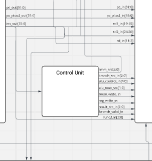
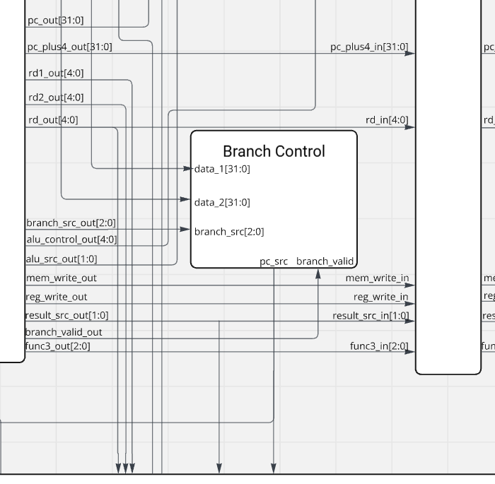

## Project Contribution and Reflection

### Contents

[**Reflections**](#reflections)

[**Design Decisions**](#design-decisions)
- [Control Unit and main_decoder.sv](#control-unit-and-main_decodersv)
- [Pipeline Branch Adjustments](#pipeline-branch-adjustments)
- [data_memory.sv](#data_memorysv)
- [Branch Unit](#branch-unit)
- [Assembly Tests](#assembly-tests)

[**What Would I Do Differently?**](#what-i-might-do-differently)

 

---

 

### Reflections

- From this project, I learned the importance of effective teamwork and collaboration, especially when balancing the contributions of team members with varying skill levels and availabilities.
- I improved my understanding of Git version control, particularly in managing a shared repository and resolving merge conflicts, which emulates a professional development environment.
- I gained practical experience in debugging and testing Verilog modules, enhancing my problem-solving skills.
- One challenge was maintaining focus and organisation while working on multiple components simultaneously. To address this, I documented processes meticulously and collaborated closely with teammates.
- My ability to manage and contribute to both single-cycle and pipelined branches has enhanced my understanding of CPU design and scalability.

### Design Decisions

#### Control Unit and main_decoder.sv

- **Relevant Contributions:**
    - Designed the main_decoder module to handle instruction decoding and control signal generation.
    - Assisted with creating and testing the testbench for the main_decoder module.

- Key design considerations included modularity and scalability to ensure the control unit could integrate seamlessly into both single-cycle and pipelined architectures.

#### Pipeline Branch Adjustments

- **Relevant Contributions:**
    - Worked alongside Darryl to adapt modules for the pipelined architecture.
    - Debugged issues in individual files within the pipelined branch, resolving data hazards and ensuring proper synchronisation.
    

- The adjustments were carefully made to preserve functionality while optimising performance for a pipelined architecture. This involved analysing data flow and modifying control signals to handle pipeline-specific challenges.

#### data_memory.sv

- **Relevant Contributions:**
    - Designed the logic for load (LB, LBU, LH, LHU, LW) and store (SB, SH, SW) instructions.
    - Incorporated func3 decoding to handle byte, halfword, and word accesses.
    - Adapted and integrated the module into the single-cycle branch before ensuring compatibility with the pipelined architecture.

- The implementation assumed aligned address access and leveraged efficient case statements for readability and maintainability.

#### Branch Unit

- **Relevant Contributions:**
    - Designed and implemented the branch unit for conditional PC updates based on comparison results.

- Moved this module outside the control unit to ensure compatibility with pipelined architectures, where the branch decision occurs in a different stage.

#### Assembly Tests

- **Relevant Contributions:**
    - Authored three assembly test files:
        - **auipc.s**: Tests the immediate addition to PC functionality.
        - **lui.s**: Verifies the functionality of loading upper immediate values.
        - **lhu_lbu.s**: Tests the loading of unsigned bytes and halfwords.
    - These tests were designed to validate the correctness of the data memory and control modules and provide debug outputs in `a0` for verification.

- The tests required careful analysis of instruction formats and edge cases to ensure robust coverage for both single-cycle and pipelined architectures.

#### Testbenches

- **Relevant Contributions**
        - Created the main decoder test bench to verify functionality and performance, which served as a guide for many of the other test benches.  
        - Collaborated with peers to enhance the formatting and structure of these test benches, ensuring consistency and clarity across the project.

#### General Debugging and Integration

- Contributed significantly to integrating modules within the CPU design by addressing module dependencies and resolving functional errors.
- Assisted in debugging the Verilog implementations across both architectures, identifying and fixing issues with synchronisation, data forwarding, and control signal propagation.

### What I Might Do Differently

- **Team Communication:** Hold more structured group meetings to clarify expectations

- **Design Improvements:** Allocate more time to refining the pipeline architecture and implementing an instruction cache for enhanced performance.

- **Testing Framework:** Develop a more comprehensive testbench suite to automate the validation of assembly tests and Verilog modules, reducing the manual testing overhead.
