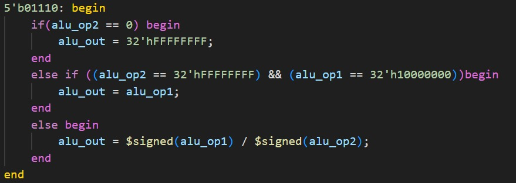

# Ethan's Personal Statment

For all commits related to pipeline please see this [repo](https://github.com/TheZuzuSnuSnu/Risc-V), access has been given to pykc. Please note that commits in the main repository will not come up under TheZuzuSnuSnu (github name), but under root. This was due to an issue with wsl.
## Overview

- Brief look
   - alu
   - register file
   - sign extend
   - pipeline registers
- Testing
- Control unit
- Hazard unit
- Pipeline top
- Additional Comments

## Brief look
### ALU
 ---
The ALU inside the pipeline folder is based off the ALU provided in single cycle, however, it also accounts for potential overflow that occurs when dividing the greatest negative number by -1.

### Register File
---
The register file is written to on the negative edge of the clock cycle making the write back stage only one clock cycle and removing the need for additoinal forwarding in the fetch stage. It has register 10 set to a0 and explicitly initalises register 0 as 0. Instead of overwriting what is written to register zero, writing to register 0 is entirely prevented. This was because overwriting it in the always_comb block would throw up errors and overwriting on a clock edge would mean an incorrect value could be propogated through the pipeline.

### Sign Extend
---
The sign extend remains similar to that of the single cycle, but does not have additional extension types to aid the ALU in shifting. Instead this responsibility is passed back to the ALU which only looks at the bottom 5 digits of the extension immediate.

### Pipeline Registers
---
Pipeline registers 3 and 4 are simple registers with noting of note. Pipeline registers 2 and 3 have a flush(rst) signald and stall signal. Stalls are made to only occur when there is a lw in the execute stage and the following instruction makes use of the register being loaded. This means the stall signal only feeds into registers 1 and 2, maintaining the current register 1 output for one more clock cycle and flushing register 2 to prevent the instruction after lw from propogating. The rst signal is controlled by the branching unit which would go high whenever a jump was taken, flushing registers 1 and 2.

## Testing
Originally, I was tasked with writing tests. Tests were written for program counter, instruction memory, register file, sign extension and later a top test for pipeline. However, these files do not currently fit with out way of executing tests, but can still be found in the archive folder. These tests were useful in letting me get a foot in the door and giving me a better understanding into both test writing and systemVerilog as a whole. The biggest finding was the way instruction memory would read files when it was made byte addressable. Instead of reading a whole word and placing it in ascending order within memory, it would read byte by byte resulting in instructions being reversed or what was essentially a big endian memory block, which conflicted with our implementation and so was made word addressable for the sake of testing. However, this was later reverted as the tests we were provided for the entire cpu would provide the instructions in reversed order.

## Control Unit
---
The control unit as I have implemented in pipeline does not have a main decoder and alu decoder as I thought it would make the files more convoluted than they needed to be. Instead they were combined into one large control unit with 6 outputs. The two most notable wires are the sign extend select wire and the data memory enable / select wire. The sign extend wire not only provides a signal to the sign extend unit but also to the hazard unit where it is used to differentiate between the different types of instructions, setting the mux wires accordingly. The data memory enable wire was made 3 bits long for the 5 load and 3 store instructions and would default to lw for instructions that did not use data memory. However, this is something I would change if I were to implement it again as although it worked for pipelining and I felt it was more efficient as there was one signal less compared to an enable store and a select wire, it made implementing cache more difficult and would have to be changed for more advanced implemenations. On top of this, my file is very long due to me explicitly declaring each wire within each opcode. Originally this was done to help me with debugging and clarity, but I believe making the file more concise would be more beneficial as those reading the files in the future would have an easier time analysing it and making changes.

## Hazard Unit
---
The hazard unit is responsible for all forwarding and stalling signals. However, both only occur when the register in question is not zero and matches the rd within the execute or memory stage. The hazard unit is also responsible for sending out this rd signal to prevent instructions that do not write to a register from having a false positive causing an incorrect forward. This is done by setting rd_out to zero for these instructions.
My hazard unit suffers from the same issue as my control unit and could stand to be more concise.

## Pipeline top
---
Once again my pipeline top could stand to be more concise by splitting the modules into seperate files for the different pipeline stages. It also has a long naming convention for wires which could stand to be redone, however, part of this was out of necessity to avoid confusion between the different origins and destination of a propogating signal.

## Additional Comments
---
I think our group had good progess and managed to get a lot done, but that is not to say there are things that can't be improved. Our greatest issue was communication and management where due to individual delays the whole group was delayed. In the future I would make sure that everyone was committing and pushing every time a change was made as well as providing regular updates and feedback. One thing our group did really well, despite being 5 people, was job allocation, where everyone always had something they could be working on or helping with and no one was left doing nothing which I believe made the project more interactive and enjoyable.